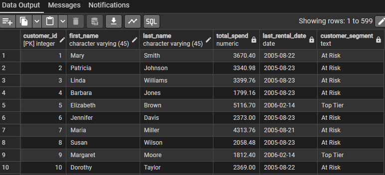

# 📀 DVD Rental Co. – Customer Retention & Content Strategy Analysis

### 🚀 Project Overview
**DVD Rental Co.** faced increasing competition from streaming services. I was tasked by the stakeholders to analyze their PostgreSQL database to identify "churn risks" (customers leaving) and optimize their movie inventory.

**Business Goals:**
1.  **Reduce Churn:** Identify customers who haven't rented recently ("At Risk").
2.  **Increase Revenue:** Determine which movie genres generate the highest ROI.
3.  **Inventory Management:** Identify "Dead Stock" (movies taking up shelf space).

### 🛠️ Tools & Technologies
* **SQL Dialect:** PostgreSQL
* **Techniques:** Common Table Expressions (CTEs), Window Functions (`LEAD`, `LAG`), Materialized Views, `JOIN`s, Complex Filtering (`CASE`).
* **Management:** pgAdmin 4

---

### 📊 Key Analysis & Insights

#### 1. Customer Segmentation (RFM Analysis)
I segmented the customer base into three tiers (`Top Tier`, `Occasional`, `At Risk`) based on their purchase history and recency.
* **Logic:** Calculated a dynamic "Current Date" (`MAX(date) + 2 days`) to simulate real-time analysis.
* **Insight:** "Platinum" customers were defined as spending over $150, while "At Risk" customers had a gap of >30 days.



#### 2. Engagement Metrics (Window Functions)
Used `LEAD` and `LAG` window functions to calculate the `Average Inter-Purchase Time` (days between rentals).
* **Findings:** Customers with an average gap of <5 days are "High Engagement," while >15 days signals potential churn.

```sql
-- Sample Code Snippet: calculating the gap
LEAD(rental_date) OVER (PARTITION BY customer_id ORDER BY rental_date) - rental_date

3. Revenue Optimization (Best Categories)
Analyzed rental duration and total revenue per genre to identify high-performing content.

Top Performer: Sports and Games generated the most revenue.

Low Performer: Children had high inventory but low rental counts.

4. Inventory Efficiency (Dead Stock Analysis)
I performed a gap analysis to identify movies that exist in the inventory but have never been rented.

Insight: The query returned 0 rows, indicating 100% inventory utilization. There is currently no 'Dead Stock' in any category, suggesting highly efficient stock rotation.

📈 Recommendations
Based on the data, I recommend:

Target "At Risk" Platinum Customers: Launch a "We Miss You" email campaign for high-spenders who haven't rented in 30 days.

Monitor Engagement: Use the new SQL View to track customers whose inter-purchase time exceeds 15 days.

Inventory Strategy: Since utilization is 100%, consider expanding the inventory of the top-performing genre (Sport/Games) to capture more demand.

Author: Joshua Egbeyemi - www.linkedin.com/in/joshua-egbeyemi-0108ja08
